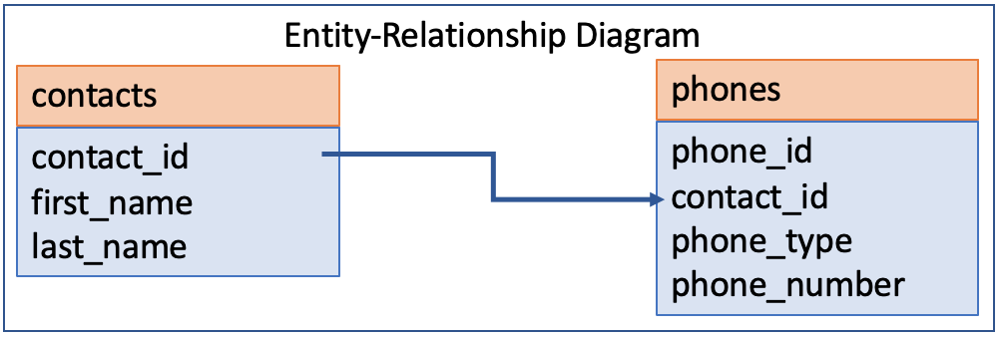
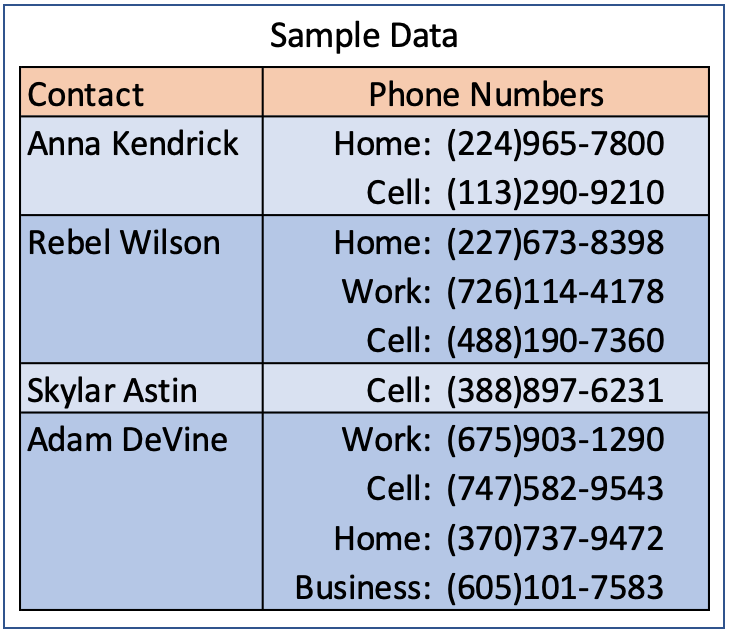

# Laboratory 11

## Laboratory Objectives
1. Explore and use various tools such as: GitHub, VirtualBox, Tuffix, Linux Terminal, and Atom.
1. Write a Python program using:
     1. sqlite3
1. Run and test a Python program.

## Getting Started
1. Open the Terminal program in Tuffix.
1. Change the present working directory to the `Documents` directory by typing the following command at the command prompt:

    ```
    cd Documents
    ```

1. Make a copy of this Github repository on your computer using the `git` and `clone` commands that you will input to the terminal. The commands take a URL as a parameter to specify where it can get a copy of the repository. You can find the URL by clicking on the green *Clone or download* button at the top right part of this page. Copy the URL and replace the example text shown below. Note that `username` should be replaced with your own Github username. When you hit <kbd>Enter</kbd> it will ask you to provide your Github username and token. Once done, you will have a copy of the repository on your computer.
    ```
    git clone https://github.com/CSUF-CPSC223P-STMAY-2021F/lab11-username.git
    ```
1. Navigate into the new directory using the command line. Note that `username` should be replaced with your own Github username.  As a shortcut, you can type the first few letters of the folder name and press <kbd>Tab</kbd> so that it auto completes the folder name for you.

     ```
     cd lab11-username
     ```
     
## Program Instructions
1. Write a Python program that performs as a Tuffy Titan Contacts phone list.  You are given the main.py file and are required to create the Contacts class.
1. The following is the Entity-Relationship Diagram for the data structure:

<p align="center">
  
</p>

1. The following is some sample data to help visualize the data model:

<p align="center">
  
</p>

1. Create a `Contacts` class to meet the following requirements:
     1. Create a file named `contacts.py`.
          1. Define a method named `__init__` to meet the following requirements:  
               1. Declare a class variable to store the database file and intitialize it to an empty string.
          1. Define a method named `set_database_name` to meet the following requirements:  
               1. Take a database file name as a positional parameter and assign the value to the class variable.
               2. If the file already exists, do nothing (we want to preserve any data in the file for continued use.)
               3. If the file does not exisit, connect to the `sqlite3` file and create the `contacts` table and the `phones` table using the proper SQL `CREATE TABLE` statement.  Use the same field names as those used in the Entity-Relationship diagram above.  Use integers for all the id's and text for all the other data.
          1. Define a method named `get_database_name` to meet the following requirements:
               1. Return the value of the class variable that stores the database name.
          1. Define a method named `add_contact` to meet the following requirements:
               1. Take a first name and last name as positionals parameter.
               2. Insert the first name and last name into the contacts table using the SQL `INSERT INTO` statement.
          1. Define a method named `modify_contact` to meet the following requirements:
               1. Take a contact id, first name, and last name as positionals parameter.
               2. Update the first name and last name of the cooresponding contact id in the contacts table using the SQL `UPDATE` statement.
          1. Define a method named `add_phone` to meet the following requirements:
               1. Take a contact id, phone type, and phone number as positionals parameter.
               2. Insert the contact id, phone type, phone number into the phones table using the SQL `INSERT INTO` statement.
          1. Define a method named `modify_phone` to meet the following requirements:
               1. Take a phone id, phone type, and phone number as positionals parameter.
               1. Update the phone type and phone number of the cooresponding phone id in the phones table using the SQL `UPDATE` statement.
          1. Define a method named `get_contact_phone_list` to meet the following requirements:
               1. Return an array created from a query on the database using the SQL statement `SELECT contacts.*, phones.* FROM contacts LEFT JOIN phones ON contacts.contact_id=phones.contact_id`.
1. Run the unit testing program to ensure that your program runs as expected.
    ```
    .python3 test.py
    ```
    The unit testing will output the results of a series of tests using specific input and expected output.  Any error will provide information on where the expected output is different from the actual output.  You will need to edit your source code to fix the error and run `./test.sh` repeatedly until it passes all the test.

## Submission
Periodically throughout the exercise, and when you have completed the exercise, **submit the complete repository to Github**.

   <pre>git add .<br>git commit -m "<i>your comment</i>"<br>git push</pre>

In case it asks you  to configure global variables for an email and name, just copy the commands it provides then replace the dummy text with your email and Github token.

   <pre>git config --global user.email "<i>tuffy@csu.fullerton.edu</i>"<br>git config --global user.name "<i>Tuffy Titan</i>"<br>git commit -m "<i>your comment</i>"<br>git push</pre>

When you completed the final Github push, go back into github.com through the browser interface and ensure all your files have been correctly updated.  You should have the following files:
```
contacts.py
test.txt
```
    
## Grading
1. All points add up to a total of 100 points possible as detailed below.  Partial credit will be given where applicable.

| Points | Description |
| --- | --- |
|50|initial git clone of this repository to your Tuffix machine|
|5|contacts.py file submitted contains the Contacts class and meets the program requirements|
|10|unit test passes Test01_ADD_CONTACT|
|10|unit test passes Test02_MODIFY_CONTACT|
|10|unit test passes Test03_ADD_PHONE|
|10|unit test passes Test04_MODIFY_PHONE|
|5|unit test passes Test05_GET_CONTACT_PHONE_LIST|
